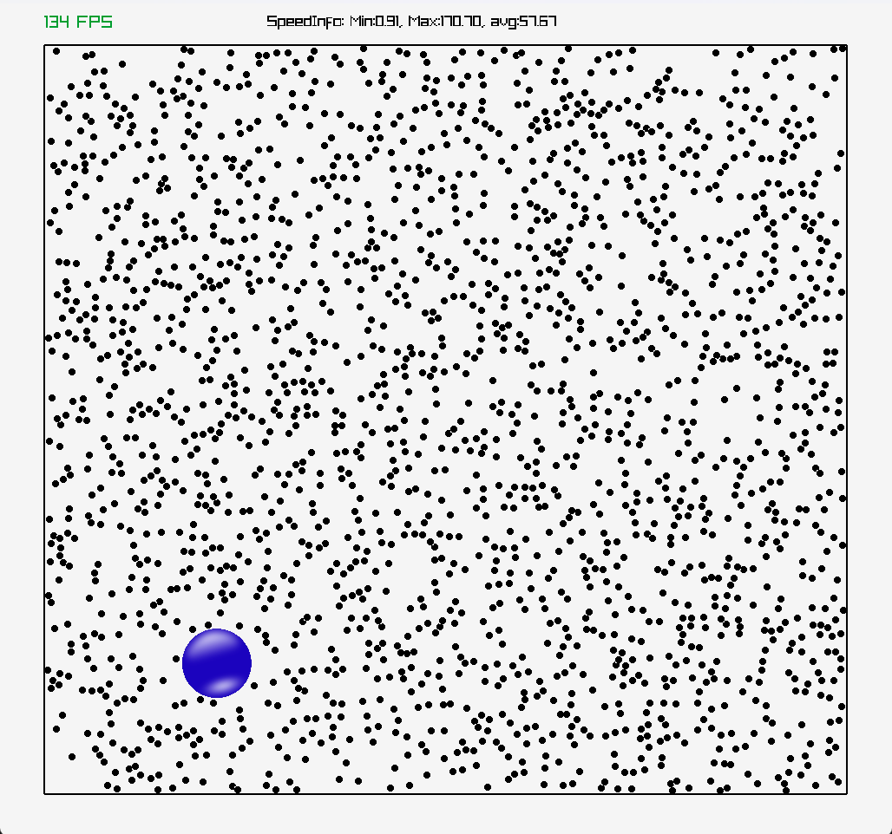
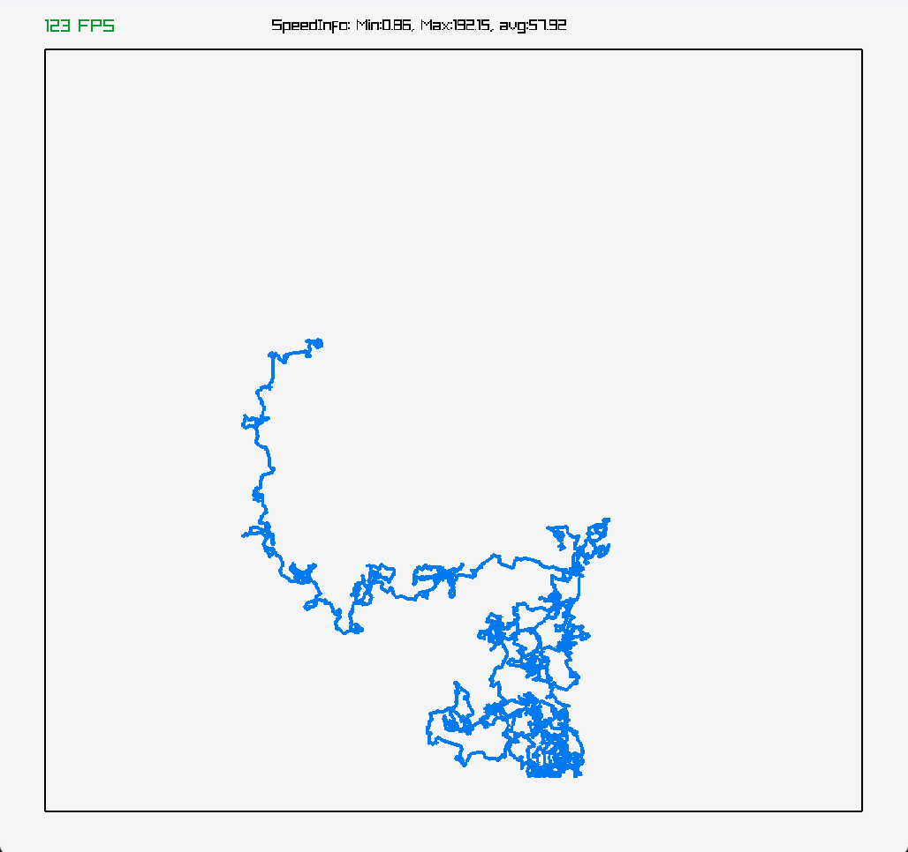

# 2D particle Collisions in C using Raylib

One of my first Raylib projects that I brushed up. 
It contains a small `particle_lib` library for handling particles in Raylib and two small examples involving elastic particle collisions in 2D.

## Brownian particle 

By pressing the `SPACE BAR` we can move over to the *Brownian path trace*-view which showes the trajectory of Brownian particle, as you would for example see in a stochastic processes in 2D (ex, [Wiener process](https://en.wikipedia.org/wiki/Wiener_process)).
See the [wikipedia page](https://en.wikipedia.org/wiki/Brownian_motion) for more information on the Brownian motion.

## Maxwell-Boltzmann distribution

Shows the Maxwell-Boltzmann distribution in real time from the velocity distrubtion.  

## Related Projects: Langevin equation & Event Driven Simulation

Instead of considering thousands of "solvent" particle interacting with a single larger Brownian particle, Paul Langevin showed in the 1920s
that the problem can be mapped to the larger particle interacting with a head bath represented by random forces, giving rise to the Langevin equation. 
You can find my study using Python Numba here:
* [Langevin equation using Python Numba](https://github.com/so-groenen/Langevin-equation-and-Brownian-motion)

Another popular approach to solving multiple interacting particles is to use the so-callled "Event-driven" approach. Here, instead of checking for collisions at every frame, we pre-compute all the collision events (treated as a class containing the colliding pairs and predicted time of collision), put them in a priority queue (ordred by decreasing collision time) and move from collision to collision. 
* [Event Driven using Python PyGame](https://github.com/so-groenen/Event-Driven-particle-simulation-in-Pygame)

